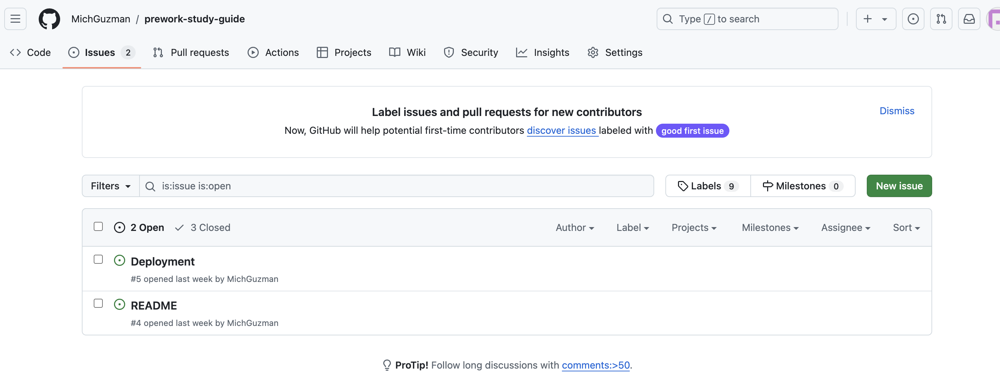
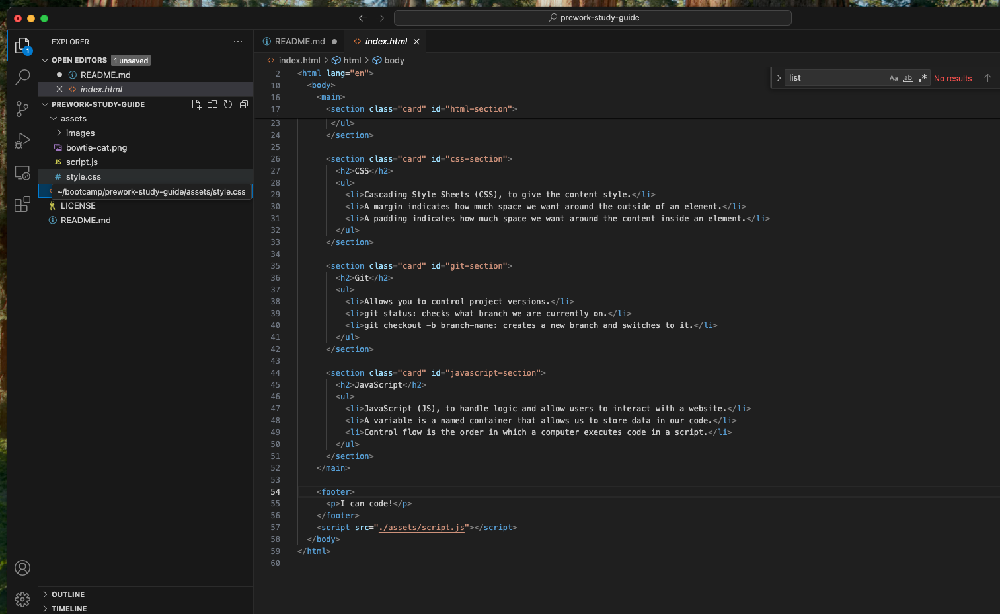

<Prework-Study-Guide Webpage>
## Description
As you work through this prework, you'll dive into the foundational skills, mindsets, and technologies that all web developers use. You'll also have opportunities to practice the habits and tasks that web developers complete every day in a professional context that mirrors what you will experience in the classroom and in your career. Finally, you'll build and deploy a simple web application that you can show off to your friends and family.


-What was your motivation?Learning web development empowers you to create digital experiences that millions of people use every day. With web development skills, you can transform ideas into working applications, solve real-world problems, and participate in creating the technology that shapes our world. Plus, web development is a skill that is constantly in demand, opening up numerous career opportunities, both in large companies and in personal projects. Learning these skills not only provides you with a solid foundation for your career, but also gives you the satisfaction of seeing the direct impact of your work online, accessible from anywhere in the world.
-Why did you build this project? I built this project to put into practice the fundamental web development concepts and skills I've learned.
-What problem does it solve? This project not only helps me practice and consolidate my knowledge of HTML, CSS, and JavaScript, but also solves the problem of how to build an interactive and visually appealing web page using these fundamental technologies.
-What did you learn?Through this project, I learned how to use HTML to structure content on a web page in a semantic and accessible way. With CSS, I gained skills in designing and styling the page, learning how to work with layouts, colors, typography, and visual effects that enhance the user experience. Additionally, by using JavaScript, I was able to add interactivity to the page, such as responding to user actions and dynamically manipulating the site's content. I also learned about the integration of these three technologies and how to work with them together to create a functional web application. In short, this project allowed me to understand how the fundamentals of web development work and how they can be applied to create rich, interactive websites.

## Table of Contents
If your README is long, add a table of contents to make it easy

- HTML
- CSS
-Java Script

## Installation

What are the steps requiered to install this project? 
1. Clone or download the repository
If the project is in a GitHub repository:

Open the terminal or command line on your computer.
Run the following command to clone the repository: git clone https://github.com/your-user/your-repository.git

2. Open the project in the code editor
Open the project directory you just cloned or checked out in your code editor.
Inside the project folder, you should see files like index.html, styles.css, and script.js.

3. Open the HTML file in a browser
Simply open the index.html file in your favorite browser to see the project in action.
You can do this by right-clicking on the file and selecting "Open with" and then choosing your browser.
Alternatively, if you use Visual Studio Code, you can install the "Live Server" extension to preview the project in real time while editing.

4. (Optional) Set up a local server (if your project uses advanced JavaScript)

If your project uses more advanced technologies that require a local server (for example, if you're using Node.js or some library that relies on a server environment):

5. Ready to start developing
You can now edit HTML, CSS, and JavaScript files and see the changes immediately in your browser.
Make sure to save the files every time you make changes so they are reflected in the preview.

## Usage
```md
    
    ```
    ```md
    
    ```
## Credits

TecMonterrey

## License

MIT License

Copyright (c) 2024 MichGuzman

Permission is hereby granted, free of charge, to any person obtaining a copy
of this software and associated documentation files (the "Software"), to deal
in the Software without restriction, including without limitation the rights
to use, copy, modify, merge, publish, distribute, sublicense, and/or sell
copies of the Software, and to permit persons to whom the Software is
furnished to do so, subject to the following conditions:

The above copyright notice and this permission notice shall be included in all
copies or substantial portions of the Software.

THE SOFTWARE IS PROVIDED "AS IS", WITHOUT WARRANTY OF ANY KIND, EXPRESS OR
IMPLIED, INCLUDING BUT NOT LIMITED TO THE WARRANTIES OF MERCHANTABILITY,
FITNESS FOR A PARTICULAR PURPOSE AND NONINFRINGEMENT. IN NO EVENT SHALL THE
AUTHORS OR COPYRIGHT HOLDERS BE LIABLE FOR ANY CLAIM, DAMAGES OR OTHER
LIABILITY, WHETHER IN AN ACTION OF CONTRACT, TORT OR OTHERWISE, ARISING FROM,
OUT OF OR IN CONNECTION WITH THE SOFTWARE OR THE USE OR OTHER DEALINGS IN THE
SOFTWARE.

🏆 The previous sections are the bare minimum, and your project will ultimately determine the content of this document. You might also want to consider adding the following sections.
## Badges


Badges aren't necessary, but they demonstrate street cred. Badges let other developers know that you know what you're doing. Check out the badges hosted by [shields.io](https://shields.io/). You may not understand what they all represent now, but you will in time.

## Features

If your project has a lot of features, list them here.

## How to Contribute

If you created an application or package and would like other developers to contribute to it, you can include guidelines for how to do so. The [Contributor Covenant](https://www.contributor-covenant.org/) is an industry standard, but you can always write your own if you'd prefer.

## Tests

Go the extra mile and write tests for your application. Then provide examples on how to run them here.